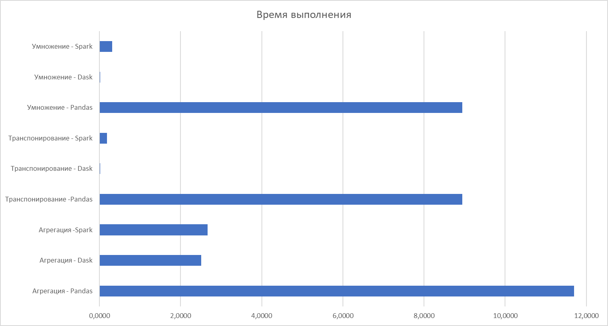

Анализ и сравнение различных способов 
обработки и хранения больших данных:
Pandas, Dask и Apache Spark

1Vgen.py
определение скорости работы с данными «чистого» Python3 на данном компьютере

ПРИМЕР:
Расчет окончен! Затрачено:
73 секунд на:
60000  записей.
Это Очень Медленно!!!

2Gencvs.py
Модуль генерирует файл данных необходимых для тестирования остальных модулей. Массив 2 случайных целых чисел от 10 до 99, 100 млн. записей.
Введите количество строк для записи в файл: 100000000

Успешно записано 100000000 строк в файл data.csv.
Время выполнения программы: 176.9311 секунд.

3Primerdip.py
Измеряем время генерации и перемножения матрицы 1000 на 1000 алгоритмическими средствами python3

Пример:
Время выполнения операции умножения матриц: 101.1346 секунд

4tstpnd.py использует библиотеку python3 – pandas

Пример:
Pandas Result:
column   value       
10      60559971
11      60561216
12      60617881
13      60535085
14      60709577
...          ...
95      60642408
96      60574337
97      60532122
98      60563213
99      60473412

[90 rows x 1 columns]
Время на агрегацию и сортировку данных: 11.731903 sec.
Время на работу с матрицами: 8.942002 sec.
Общее время выполнения задач: 20.673905 sec.

5daskpack.py использует пакет python3 – Dask

Пример:
Dask Result:
column    value      
10      60559971
11      60561216
12      60617881
13      60535085
14      60709577
...          ...
95      60642408
96      60574337
97      60532122
98      60563213
99      60473412

[90 rows x 1 columns]
Agg Time: 2.513999 seconds
Matr Time: 0.017000 seconds
Total Execution Time: 2.531000 seconds

6sparkpak.py - применяется алгоритмическая обработка матриц

Пример:

Результат Spark:
Время агрегации: 4.12000 секунды
Время транспонирования: 2.534567 секунды
Время умножения: 3.345678 секунды
Общее время выполнения: 10.00 секунды

6sparkpaknum.py обработка матриц с пакетом numpy

Пример:
Agg Time: 2.66523 seconds
Transpose Time: 0.191300 seconds
Multiplication Time: 2.312500 seconds
Total Execution Time: 5.16903 seconds
Process finished with exit code 0

